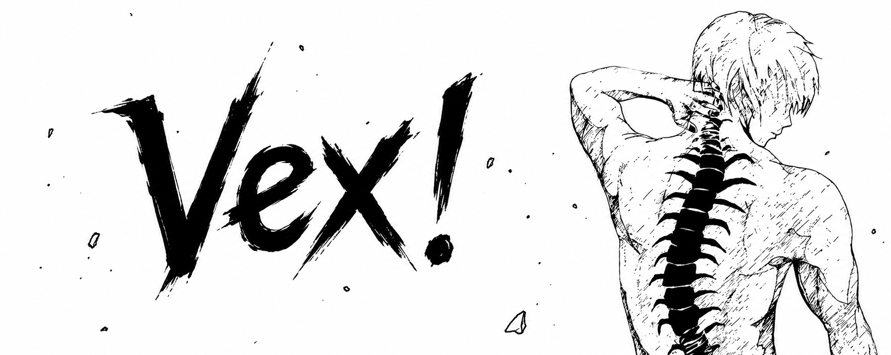

<div align="center">



</div>

<p align="center">
  
</p>

---

<h1 align="center">Know About Me</h1>

<table>
<tr>
<td width="45%" align="center">


</td>

<td width="55%">

```cpp
Hey. I’m Aaditya Kharakwal — call me Vex.

Class 11. Commerce + CS.
Full-time problem solver.

I code by instinct.
If something is repetitive, I automate it.
If it is difficult, I dissect it.

Python and C++ are my weapons.
AI is leverage.
Linux is home.

I do not move slowly.
I build systems that move faster than people think.

From zero to execution.
That is the only thing that matters.
